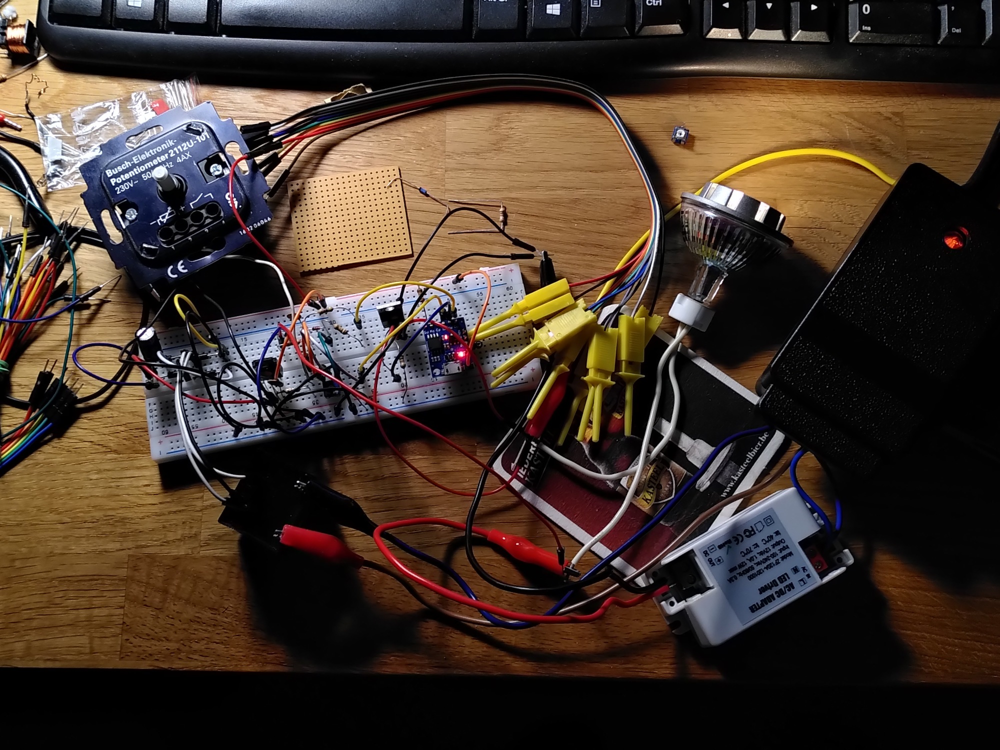
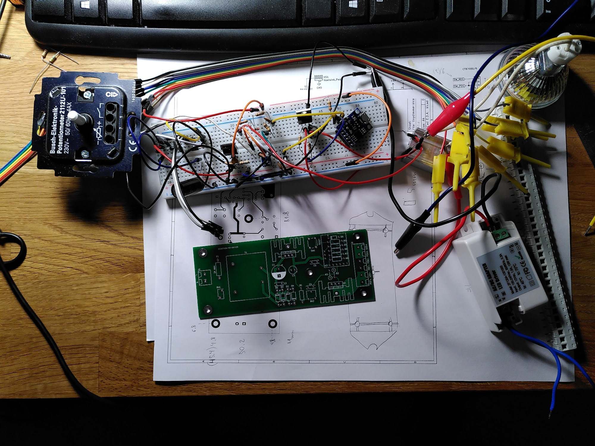
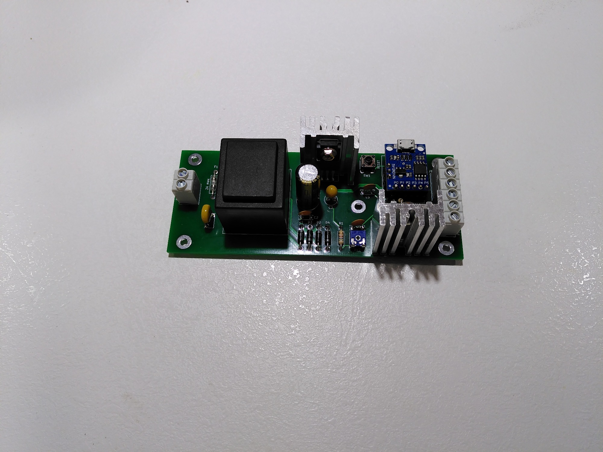
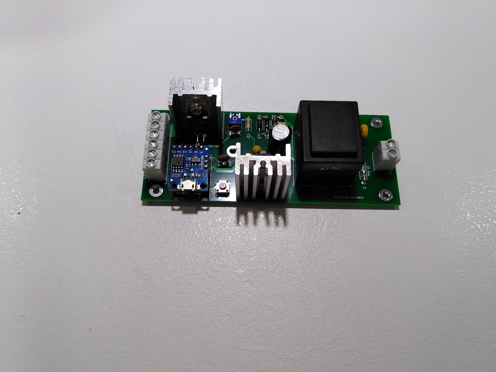
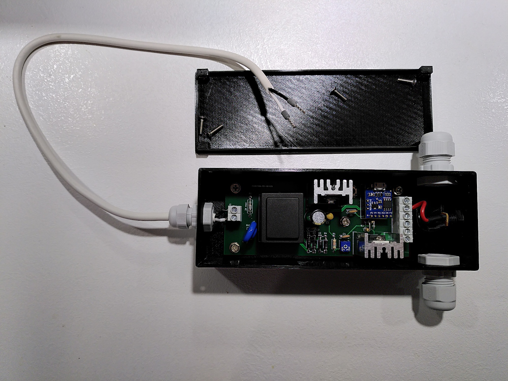

# Tinydimmer

LED dimmer with 1-10V control using ATtiny85 microcontroller.

## Motivation

An existing 1-10V controlled LED dimmer in my bathroom doesn't work well with dimmable Osram Superstar 2700K 7.8W MR16 lamps. Its dimming range start is below the minimum power at which the LED lamps start reliably.  
As a result the lamps start with a sudden flash after 1/3 turn of the dimmer controller pot. The 1-10V controlled dimmer I have doesn't have any means to adjust the dimming range, so I had to build my own.

## Parts Used

Here are some notes about parts used for this project. As usual I tend to reuse parts left from previous projects and even something scavenged from broken electronics, so not all parts are listed here.  
The case was printed using black Prusament PETG leftovers from the MK3S printer upgrade (<100g consumed in total).  
The PCB was ordered from JLCPCB. They once again did a fantastic job with Gerbers to delivered PCB in under a week.

`RV1` - originally planned to use a plain MOV (7N431K), but after assembling decided to switch for a Bourns 14D271K GMOV (basically a MOV and a gas discharge tube in one package) for improved safety.

`TR1` - a Hahn EL 305 2051 9V 3W PCB transformer. Just had one laying around. Open circuit gives ~17V AC, drops to 9V AC under rated load.

`D1`..`D4` - 1N5819 Schottky diodes. According to spec can withstand up to 28V RMS reverse voltage with <0.6V drop. Used purely for low voltage drop to give `U1` LDO some margin.

`U1` - Rohm BAJ0CC0T 10V LDO regulator. Probably some other LDO regulator can do, but bear in mind that it must work with `9 x 1.41 - 2 x 0.6 - 10 = 1.49V` dropout if using a 9V AC transformer. Consider choosing another transformer and LM7810 to keep things simpler.

`U2` - Digispark USB clone with ATtiny85 onboard. Brains of the operation.

`J1`, `J2` - CamdenBoss CTB7000 series cut-to-length terminal blocks. Bought actually as CTB7000/36 and, well, cut to length.

`C1` - 820uF 25V low ESR Panasonic capacitor. Could have gotten away with a much smaller value (`U1` spec mandates at least 0.33uF), but just didn't want to put some off-brand ones with smaller value.

`C3` - 47uF 16V tantalum capacitor. According to `U1` spec should be fairly large (at least 22uF) to prevent output oscillation.

`C4`, `C5` - 0.1uF 25V ceramic capacitors. Probably not needed on an actual PCB, but somewhat improved stability while prototyping.

`Q1` - IRL540N, but can be any logic-level n-channel MOSFET having the same pinout.

`R1` - 560R 1/4W resistor to limit current for the 1-10V Busch-Jaeger electronic potentiometer. Spec says it can sink up to 50mA. When prototyping with 12V Vcc I used 1K.

`RV2` - a 25k pot looking like from [ACP](https://www.acptechnologies.com/). I advise to adjust it a notch _below_ dead center so that voltage on its wiper is 4.98-4.99V to be on the safe side. We can remap anything in software after all.

`HS1` and `HS2` were taken from an old ATX PSU. The one for `Q1` isn't actually needed as it barely gets warm with 490Hz PWM. The one for `U1` is recommended though.

## Operation Mode

When referring to microcontroller pins I use the pin layout from the Digispark USB clone I have (`P0`..`P5`).

After power on and boot:

1. `P0` is checked for `HIGH`.

2. If `HIGH`, the control voltage is read as an analog value is from `P2` and divided by 4.

3. If control voltage value is less than low threshold, the minimum PWM value is written to `P1` (in my case 16, i.e. 6% duty cycle).

4. If control voltage value is less than high threshold (in my case 240), the maximum PWM value (255) is written to `P1`. Done because control voltage is not actually 10V, but in 9.7..9.8V range.

5. If `P0` is `LOW`, 0 is written to `P1` turning LEDs completely off.

6. Sleep for 100ms.

## ~~Known Issues~~ Room for Improvement

* Currently the dimmer is powered on constantly since I haven't yet figured out how to program ATTiny85 without a bootloader (or with a minimal one). Default boot times are over 2 seconds. This consumes ~2W at all times, so can add up to ~20kWH a year. Will definitely be revisiting this. [#1](https://github.com/virtual-machinist/tinydimmer/issues/1)

* The case warped a bit after cooling and could use a couple of more screws in the middle of the lid. And/or latches. My FreeCAD-fu is weak ATM. [#2](https://github.com/virtual-machinist/tinydimmer/issues/2)

## Photos

Working prototype:

Starting PCB assembly:

Assembled PCB front:

Assembled PCB back:

Assembled case:

## Contributing

If you have any questions or remarks for this design, feel free to open an issue.
